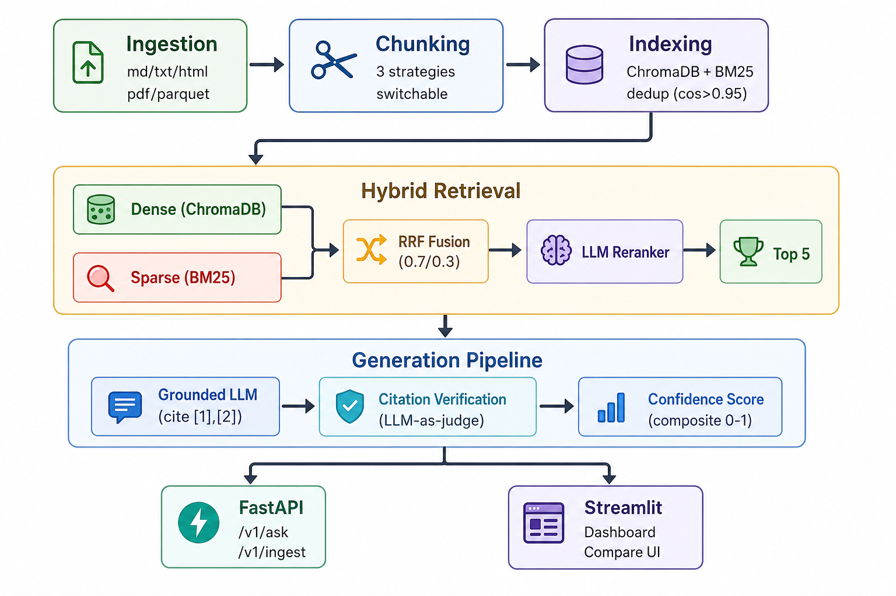
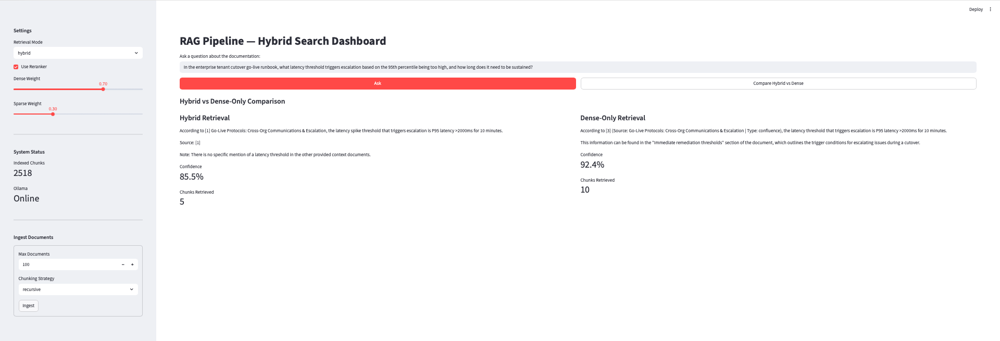
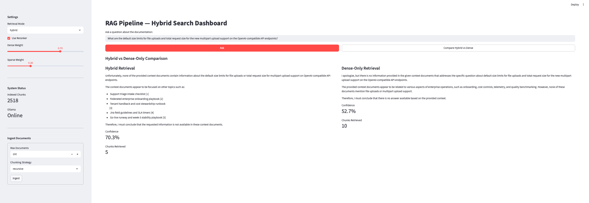

# RAG Pipeline with Hybrid Search Over Internal Docs

A production-grade Retrieval-Augmented Generation system that ingests enterprise documentation, indexes it with both dense vector and sparse keyword search, retrieves the most relevant context for any question, and generates grounded answers with inline source citations — all powered by local LLMs via Ollama. No API keys. No cloud dependencies. Fully offline-capable.

Built on the [EnterpriseRAG-Bench](https://huggingface.co/datasets/onyx-dot-app/EnterpriseRAG-Bench) dataset — 500K+ enterprise documents spanning Confluence, GitHub, Slack, Gmail, Jira, and more — with 500 golden Q&A pairs for rigorous evaluation.

## What Makes This Different

Most RAG demos index a single PDF and call it a day. This system implements the production concerns that actually matter:

- **Hybrid Retrieval** — Dense vector search catches semantic meaning. BM25 sparse search catches exact keywords, function names, and config keys. Reciprocal Rank Fusion combines both with configurable weighting.
- **Cross-Encoder Reranking** — After fusion, an LLM-as-judge scores each chunk's actual relevance to the question. Top 20 candidates become the 5 most relevant.
- **Citation Verification** — Every `[1]`, `[2]` reference in the generated answer is verified. Does the cited source actually support the claim? Each citation-claim pair is checked by an LLM judge.
- **Confidence Scoring** — Three-dimensional scoring: retrieval relevance, citation coverage, and answer completeness. Low confidence triggers a structured "I don't know" with partial findings instead of hallucination.
- **Three Chunking Strategies** — Fixed-size with overlap, recursive splitting by section headers, and semantic chunking by embedding similarity. Switchable per-ingestion with side-by-side evaluation comparison.
- **Near-Duplicate Detection** — Cosine similarity > 0.95 between chunk embeddings flags and skips duplicates, preventing the retriever from wasting context window slots.
- **59 Automated Tests** — Covering ingestion, chunking, retrieval fusion logic, citation parsing, confidence scoring, API validation, and OpenAPI schema correctness.

## Architecture



## Demo

### Grounded Answer with Verified Citations

When the answer exists in the indexed documents, the system retrieves the correct chunks, generates a grounded answer with inline `[n]` citations, and verifies each citation against its source — achieving 85.5% (hybrid) and 92.4% (dense-only) confidence.



### Graceful "I Don't Know" Handling

When the question falls outside the indexed knowledge base, the system doesn't hallucinate. Instead, it explicitly states the information is not available and lists what it did find — letting the user decide where to look next.



## Performance Tradeoffs

Every RAG system lives on a spectrum between accuracy and speed. This pipeline is designed for correctness first, but every layer can be tuned depending on what matters most for your use case.

### Want Maximum Accuracy? Keep Everything On.

The full pipeline runs hybrid retrieval, reranks with an LLM judge, verifies every citation, and scores confidence before returning an answer. This is the slowest path (~60-80s per query on a MacBook with Ollama), but it catches hallucinations, flags unsupported citations, and knows when to say "I don't know." If you're building something where wrong answers are worse than slow answers — compliance tools, medical documentation, legal research — this is the mode to use.

### Want It Faster? Here's What to Turn Off (and What You Lose).

| Change | Time Saved | What You Give Up |
|--------|-----------|-----------------|
| **Disable reranker** (`use_reranker: false`) | ~40-50s | Reranker is the biggest bottleneck — it makes 20 separate LLM calls. Without it, you rely on RRF fusion scores alone. Precision drops on ambiguous queries, but straightforward lookups are barely affected. |
| **Disable citation verification** | ~10-15s | Citations still appear in the answer, but nobody checks if `[1]` actually supports the claim. Good enough for internal tools where users can click through to source docs. Risky for anything customer-facing. |
| **Use dense-only retrieval** (`retrieval_mode: "dense"`) | ~2-3s | Skips BM25 and fusion. You lose exact keyword matching — if someone searches for a specific config key like `max_file_size` or an error code, dense search might miss it while BM25 would nail it. |
| **Reduce fusion candidates** (FUSION_TOP_K: 20 → 10) | ~20s | Fewer chunks go through the reranker. Slightly higher chance of missing a relevant chunk that ranked 11th-20th in fusion. |
| **Smaller generation model** (switch to Phi-3 or Gemma 2B) | ~50-70% faster generation | Faster but less capable at following citation instructions and producing well-structured answers. Works fine for simple factual lookups, struggles with multi-hop reasoning. |

### Want Both? Here's the Roadmap.

These optimizations would significantly reduce latency without sacrificing accuracy, but they require additional implementation:

- **Parallel reranking** — Score all 20 candidates concurrently instead of sequentially. Same accuracy, ~5x faster reranking. Requires threading since Ollama handles concurrent requests.
- **Parallel citation verification** — Verify all citations at once instead of one-by-one. Same accuracy, verification drops from ~10s to ~2s.
- **Batch embeddings** — Ollama's embed API supports batch input. Sending all chunks in one call instead of individually would dramatically speed up ingestion.
- **Dedicated reranker model** — Replace the LLM-as-judge reranker with a lightweight cross-encoder model (like `bge-reranker-base`). Purpose-built for relevance scoring, runs 10-100x faster than prompting a full LLM.
- **Query embedding cache** — Cache recent query embeddings so repeated or similar questions skip the embedding step entirely.
- **Async everything** — Move all Ollama calls to `httpx.AsyncClient` so the FastAPI server isn't blocked waiting on model inference.

The current design intentionally prioritizes correctness and explainability over raw speed. Every slow component exists because it catches a real failure mode — the reranker catches irrelevant chunks that fooled vector search, citation verification catches hallucinated references, and confidence scoring catches answers the model isn't sure about. The right question isn't "how do I make it faster" but "which safety nets can I afford to remove for my use case."

## Tech Stack

| Component | Technology | Why |
|-----------|-----------|-----|
| Language | Python 3.11+ | Ecosystem standard for AI/ML |
| LLM | Ollama (Llama 3) | Local, free, no API keys |
| Embeddings | Ollama (nomic-embed-text) | Local, 768-dim, high quality |
| Vector Store | ChromaDB | File-based, zero config |
| Sparse Search | rank_bm25 | Fast BM25 keyword matching |
| API | FastAPI | Async, auto-generated OpenAPI docs |
| Dashboard | Streamlit | Rapid prototyping, interactive |
| Containers | Docker Compose | One-command deployment |

## Quick Start

### Prerequisites

- **Python 3.11+** — [python.org/downloads](https://www.python.org/downloads/)
- **Ollama** — [ollama.com/download](https://ollama.com/download)
- **Git** — [git-scm.com](https://git-scm.com/)

### 1. Clone and Install

```bash
git clone https://github.com/ujjwalredd/RAG-Pipeline.git
cd rag-pipeline

pip install -e ".[dev]"
```

### 2. Start Ollama and Pull Models

```bash
# Start Ollama (keep this terminal open)
ollama serve

# In a new terminal, pull the required models
ollama pull llama3              # ~4.7 GB — generation, reranking, citation verification
ollama pull nomic-embed-text    # ~274 MB — embeddings
```

### 3. Download the Dataset

The project uses [EnterpriseRAG-Bench](https://huggingface.co/datasets/onyx-dot-app/EnterpriseRAG-Bench), a 500K+ document enterprise dataset (MIT licensed, ~1.3 GB).

```bash
pip install huggingface_hub

python3 -c "
from huggingface_hub import snapshot_download
snapshot_download(
    repo_id='onyx-dot-app/EnterpriseRAG-Bench',
    repo_type='dataset',
    local_dir='data/EnterpriseRAG-Bench'
)
print('Download complete!')
"
```

This creates `data/EnterpriseRAG-Bench/` with:
- `data/documents/test.parquet` — 511,962 documents (Confluence, GitHub, Slack, Gmail, Jira, etc.)
- `data/questions/test.parquet` — 500 golden Q&A pairs with expected doc IDs and answer facts

### 4. Start the API Server

```bash
uvicorn src.api.main:app --reload --port 8000
```

API docs available at [http://localhost:8000/docs](http://localhost:8000/docs)

### 5. Ingest Documents

Via the API:
```bash
curl -X POST http://localhost:8000/v1/ingest \
  -H "Content-Type: application/json" \
  -d '{"max_docs": 200, "chunking_strategy": "recursive"}'
```

Or via the seed script (also pulls models if needed):
```bash
python3 scripts/seed.py
```

### 6. Ask Questions

```bash
curl -X POST http://localhost:8000/v1/ask \
  -H "Content-Type: application/json" \
  -d '{"question": "What are the default size limits for file uploads?"}'
```

### 7. Launch the Dashboard

```bash
streamlit run src/dashboard/app.py
```

Open [http://localhost:8501](http://localhost:8501) to interact with the full UI.

## Docker Setup (Alternative)

Run everything with one command — Ollama, API, and Dashboard:

```bash
docker-compose up --build
```

| Service | URL |
|---------|-----|
| API | http://localhost:8000 |
| Dashboard | http://localhost:8501 |
| Ollama | http://localhost:11434 |

The seed script runs automatically on first start, pulling models and indexing 200 sample documents.

## API Reference

### `POST /v1/ask` — Ask a Question

```json
{
  "question": "What caused the Feb 12 usage export incident?",
  "retrieval_mode": "hybrid",
  "use_reranker": true,
  "dense_weight": 0.7,
  "sparse_weight": 0.3
}
```

The response includes the answer with `[n]` citations, citation verification results showing whether each reference is supported or not, confidence scores broken down by retrieval quality, citation coverage, and completeness, and the full retrieved chunks with their metadata.

### `POST /v1/ingest` — Index Documents

```json
{
  "max_docs": 500,
  "source_types": ["confluence", "github"],
  "chunking_strategy": "recursive"
}
```

### `GET /v1/documents` — List Indexed Documents

### `GET /health` — System Status

Returns indexed chunk count and Ollama availability.

## Evaluation

### Run the Full Eval Suite

```bash
python3 -m src.evaluation.run_eval
```

This evaluates the pipeline against the golden Q&A dataset and reports five metrics:

| Metric | What It Measures |
|--------|-----------------|
| Answer Correctness | LLM-as-judge comparison against gold answer |
| Faithfulness | Are all claims grounded in retrieved context? |
| Retrieval Relevance | Precision — what percentage of retrieved chunks come from expected docs |
| Retrieval Recall | What percentage of expected docs were found in retrieved chunks |
| Citation Accuracy | What percentage of `[n]` citations are verified as supported |

Results are saved to `eval_results/` as `summary.json` and `results.jsonl`, broken down by question type including basic, semantic, multi-hop, conflicting info, and more.

### Compare Chunking Strategies

```python
from src.ingestion.enterprise_loader import load_enterprise_dataset
from src.evaluation.compare import ChunkingComparison

docs = load_enterprise_dataset(max_docs=200)
comparison = ChunkingComparison(docs, max_eval_cases=50)
report = comparison.run()
```

This runs the same eval suite across all three chunking strategies and produces a side-by-side comparison showing which strategy wins on which metrics. It gives you concrete numbers to back up architecture decisions in interviews or design reviews.

## Testing

```bash
# Run all 59 tests
pytest

# Run a specific module
pytest tests/test_retrieval.py -v

# Run a single test
pytest tests/test_retrieval.py::TestReciprocalRankFusion::test_weight_affects_ranking -v

# Lint
ruff check src/ tests/
ruff format src/ tests/
```

## Project Structure

```
src/
├── ingestion/          # Document loading (md, txt, html, pdf, parquet)
│   ├── loader.py           # Multi-format file loader with normalization
│   └── enterprise_loader.py # EnterpriseRAG-Bench parquet loader
├── chunking/           # Three switchable chunking strategies
│   ├── fixed_size.py       # Fixed-size windows with configurable overlap
│   ├── recursive.py        # Structure-aware splitting by section headers
│   ├── semantic.py         # Topic-boundary splitting via embedding similarity
│   └── factory.py          # Strategy factory with enum selection
├── indexing/           # Embedding generation and dual-index storage
│   ├── embeddings.py       # Ollama embedding API (supports v0.24+ and legacy)
│   ├── vector_store.py     # ChromaDB operations (cosine similarity)
│   ├── bm25_index.py       # BM25Okapi index with persistence
│   ├── deduplication.py    # Near-duplicate removal (cosine > 0.95)
│   └── pipeline.py         # Orchestrates chunk → embed → dedup → index
├── retrieval/          # Hybrid search with fusion and reranking
│   ├── dense.py            # Vector similarity search via ChromaDB
│   ├── sparse.py           # BM25 keyword search
│   ├── fusion.py           # Reciprocal Rank Fusion (configurable weights)
│   ├── reranker.py         # LLM-as-judge relevance scoring (0-10)
│   └── hybrid.py           # Full pipeline: dense + sparse → RRF → rerank
├── generation/         # Grounded answer generation with verification
│   ├── prompts.py          # All prompt templates
│   ├── generator.py        # Context-grounded LLM generation
│   ├── citations.py        # Citation extraction and LLM verification
│   ├── confidence.py       # Three-dimensional confidence scoring
│   └── pipeline.py         # Full pipeline with "I don't know" handling
├── evaluation/         # Automated evaluation framework
│   ├── dataset.py          # Golden Q&A dataset loading (500 cases)
│   ├── metrics.py          # 5 automated metrics with LLM-as-judge
│   ├── run_eval.py         # Full suite runner with reporting
│   └── compare.py          # Chunking strategy comparison benchmarks
├── api/                # FastAPI service
│   ├── main.py             # Routes: /v1/ask, /v1/documents, /v1/ingest
│   ├── schemas.py          # Pydantic request/response models
│   └── dependencies.py     # Singleton app state management
├── dashboard/          # Streamlit interactive UI
│   └── app.py              # Query UI, citation viewer, hybrid vs dense comparison
├── config.py           # All configuration constants
└── models.py           # Document and Chunk data classes

tests/                  # 59 tests across all modules
scripts/
└── seed.py             # Auto-setup: pull models + index sample docs
```

## Configuration

All settings live in `src/config.py`. Here are the ones you're most likely to change:

| Setting | Default | Description |
|---------|---------|-------------|
| `EMBEDDING_MODEL` | `nomic-embed-text` | Ollama embedding model |
| `GENERATION_MODEL` | `llama3` | Ollama generation model |
| `CHUNK_SIZE` | 512 | Characters per chunk |
| `CHUNK_OVERLAP` | 64 | Overlap between chunks |
| `RRF_DENSE_WEIGHT` | 0.7 | Dense retrieval weight in fusion |
| `RRF_SPARSE_WEIGHT` | 0.3 | Sparse retrieval weight in fusion |
| `FUSION_TOP_K` | 20 | Candidates after fusion |
| `RERANK_TOP_K` | 5 | Final chunks after reranking |
| `DEDUP_SIMILARITY_THRESHOLD` | 0.95 | Cosine threshold for deduplication |

To swap in a different model like Mistral, Phi-3, or Gemma, just pull it and update the config:
```bash
ollama pull mistral
```
Then change `GENERATION_MODEL` in `src/config.py`.

## Sample Questions to Try

The dataset simulates "Redwood Inference," an AI inference company. Here are questions across difficulty levels to test different parts of the pipeline:

**Basic Lookup:**
> What are the default size limits for file uploads and total request size for the new multipart upload support on the OpenAI-compatible API endpoints?

**Semantic Search:**
> When does booking open for the new top end 80GB accelerator on dedicated clusters?

**Multi-Document Reasoning:**
> During the 2025-02-10 capacity incident, what two thresholds should trigger noisy-tenant detection?

**Conflicting Information:**
> On Streamly AI's dedicated pool, what % of interactive burst credits should be reserved for priority=high routes?

**Info Not Found (tests the "I don't know" path):**
> For the admin activity chronicle's daily Merkle-root anchoring, which public blockchain network do we anchor to?

## License

MIT
